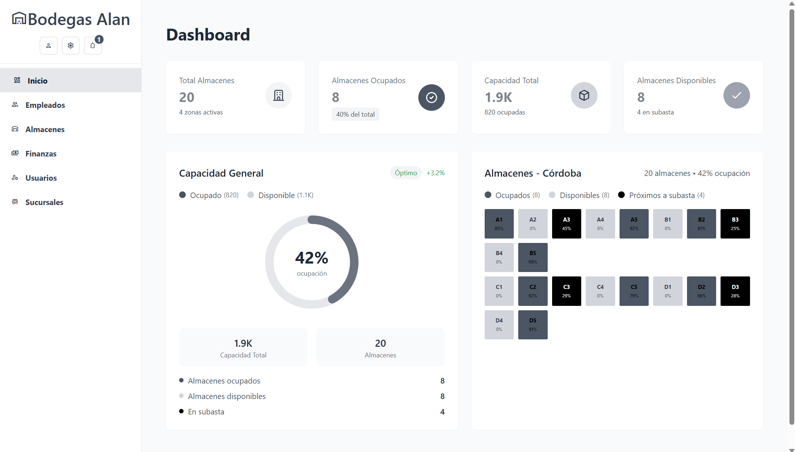
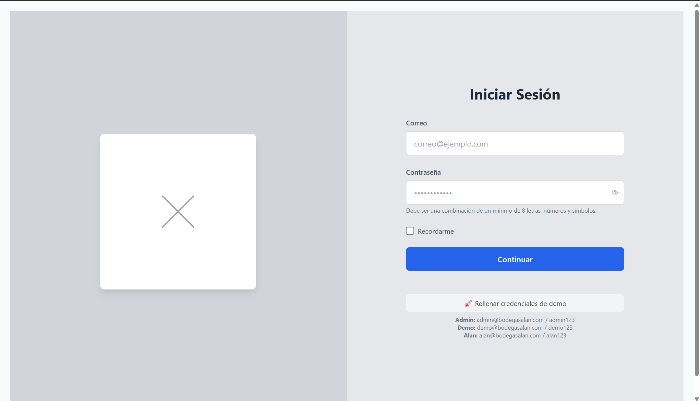
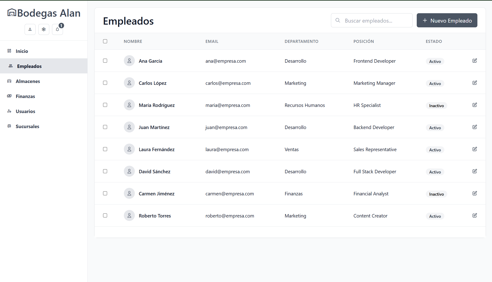
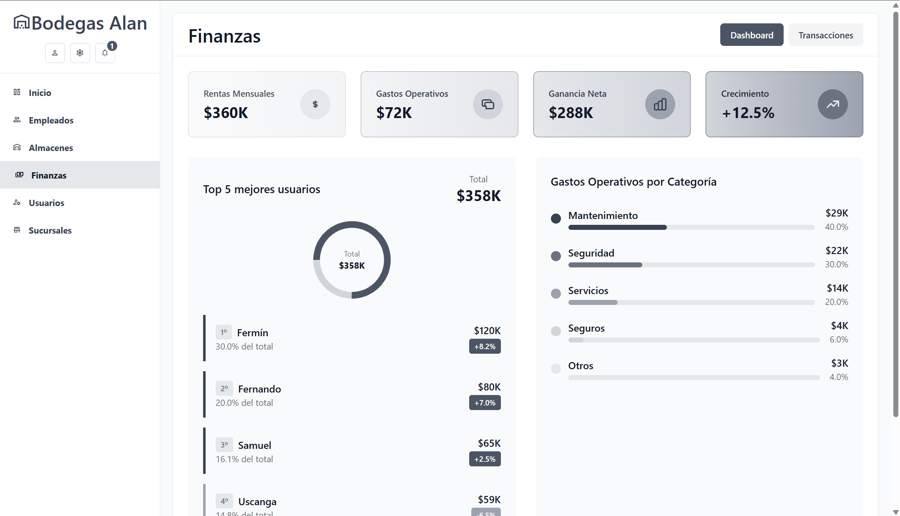
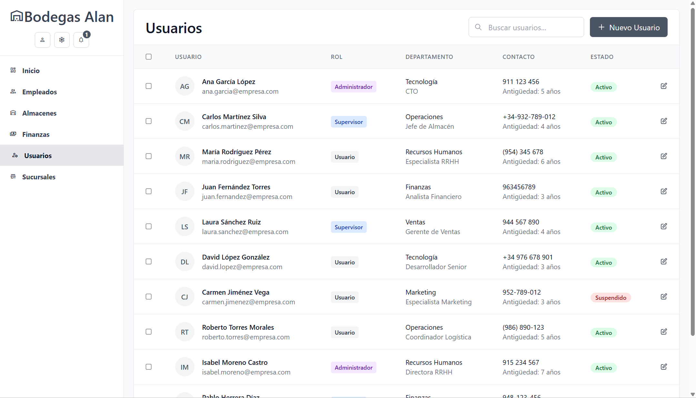
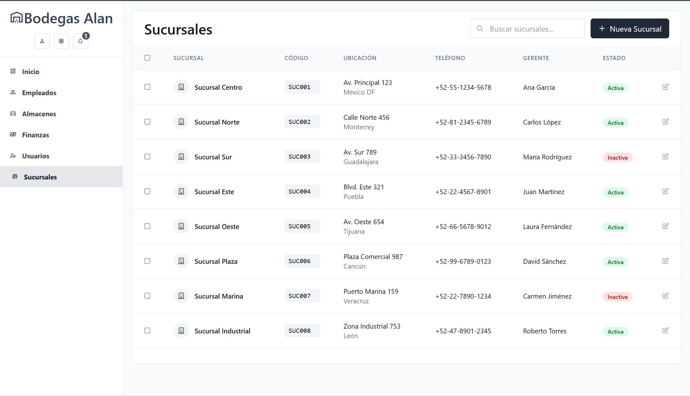

# 🏢 Bodegas Alan – Gestión de Bodegas y Subastas



## 🚀 Descripción General

**Bodegas Alan** es una aplicación web moderna para la gestión de bodegas, empleados, finanzas y subastas, con funcionalidades específicas para cada sucursal (Córdoba y Orizaba).

Incluye:
- Control centralizado de empleados, almacenes y usuarios
- Gestión financiera y panel de control en tiempo real
- Administración de múltiples sucursales
- Seguridad y experiencia de usuario premium

---

## 🖼️ Módulos principales

<table>
  <tr>
    <td align="center"><b>Login</b></td>
    <td align="center"><b>Dashboard</b></td>
    <td align="center"><b>Empleados</b></td>
  </tr>
  <tr>
    <td></td>
    <td></td>
    <td></td>
  </tr>
  <tr>
    <td align="center"><b>Almacenes</b></td>
    <td align="center"><b>Finanzas</b></td>
    <td align="center"><b>Usuarios</b></td>
  </tr>
  <tr>
    <td></td>
    <td></td>
    <td></td>
  </tr>
  <tr>
    <td align="center" colspan="3"><b>Sucursales</b></td>
  </tr>
  <tr>
    <td colspan="3" align="center"></td>
  </tr>
</table>

---

## ✨ Características

- 🔐 **Sistema de login seguro y validación por roles**
- 📊 **Dashboard con KPIs, gráficas y accesos rápidos**
- 👷‍♂️ **Gestión de empleados por sucursal**
- 🏪 **Control de almacenes y unidades disponibles**
- 💰 **Módulo financiero con control de ingresos y egresos**
- 👥 **Gestión de usuarios y permisos**
- 🏢 **Administración de sucursales**
- 💡 **UI moderna y responsiva con Tailwind CSS y Angular**

---

## 🛠️ Tecnologías

- [Angular 16+](https://angular.io/)
- [Tailwind CSS 3+](https://tailwindcss.com/)
- HTML5 + CSS3
- TypeScript
- [SweetAlert2](https://sweetalert2.github.io/)
- [Heroicons](https://heroicons.com/)

---

## ⚙️ Requisitos previos

- Node.js 18+ y npm
- Angular CLI (`npm install -g @angular/cli`)

---

## 🚩 Pasos para ejecutar el proyecto

1. **Clona este repositorio:**
    ```bash
    git clone https://github.com/tuusuario/BodegasAlan.git
    cd BodegasAlan
    ```

2. **Instala dependencias:**
    ```bash
    npm install
    ```

3. **Ejecuta la aplicación:**
    ```bash
    ng serve --open
    ```
    La aplicación se abrirá automáticamente en [http://localhost:4200](http://localhost:4200).

---

## 📝 Versiones

- **v1.0.0**  
  - Login funcional, dashboard interactivo  
  - Módulos completos de empleados, almacenes, finanzas, usuarios y sucursales  
  - UI 100% responsiva con Tailwind

---

## 💡 Autor

- Fermin Cárdenas | [GitHub](https://github.com/Fermin-Cardenas)

---

## 📬 ¿Preguntas? ¿Comentarios?

¡Contáctame por GitHub o abre un issue en el repositorio!  
**Bodegas Alan** – El futuro del almacenamiento inteligente en Veracruz.
